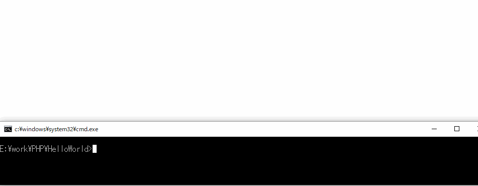

# mycommands
自作コマンド集

## Demo




## Usage

パイプ経由の為、標準エラー出力に出力される場合は標準出力に変換する

PHP Linterの結果一覧から選択し、gvimで開く

```
> php-linter php-l | loclist-gvim php
```

C++のmakeエラー一覧から選択し、gvimで開く

```
> make 2>&1 1>nul | loclist-gvim cpp
```

Golangのgo buildエラー一覧から選択し、gvimで開く

```
> go build 2>&1 | loclist-gvim go
```

## Installation

```
> make && make release
```

のあと、このフォルダへパスを通す
